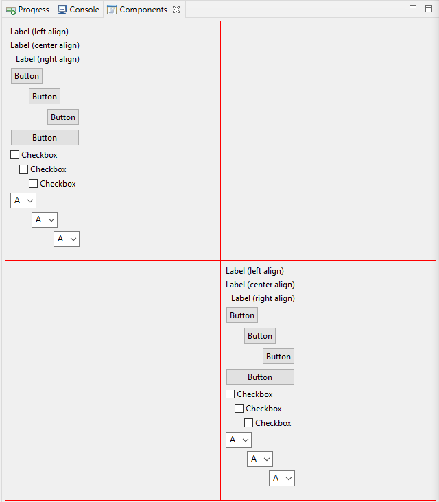
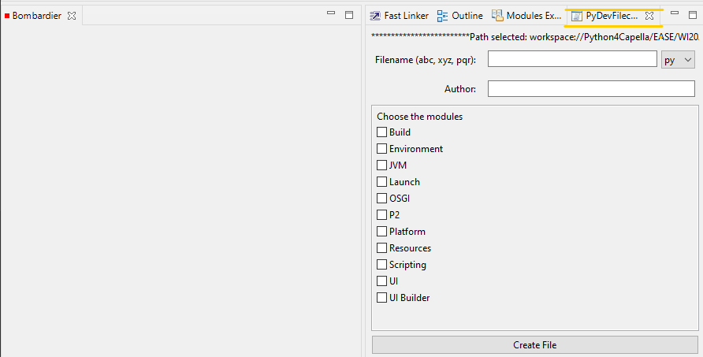

# UI Builder Module

## Official Documentation

The module can be found at `Help > Help Contents > Scripting User Guide > Reference > Loadable modules reference > System > UI Builder` but the documentation is a bit scarce and requires better example for better utilization

## Table of Contents

- [Usage](#1-usage)
- [Methods](#2-methods)

  1. [Core](#core) Need to learn more about it yet
      - addControl()
      - removeControl()
  2. [Components](#components)
      - [createButton()](#createbutton)
      - [createCheckBox()](#createcheckbox)
      - [createComboViewer()](#createcomboviewer)
      - [createProgressBar()](#createprogressbar)
      - [createRadioButton()](#createradiobutton)
      - [createText()](#createtext)
      - [createTextBox()](#createtextbox)
      - [createImage()](#createimage-note-yet-to-explore)
      - [createLabel()](#createlabel)
  3. [Containers](#containers)
      - [createGroup()](#creategroup)
      - [createComposite()](#createcomposite)
      - [pushComposite()](#pushcomposite)
      - [popComposite()](#popcomposite)
      - [getComposite()](#getcomposite)
      - [createScrolledComposite()](#createscrolledcomposite)
  4. [Viewers](#viewers)
      - [createView()](#createview)
      - [createListViewer()](#createlistviewer)
      - [createTableViewer()](#createtableviewer)
      - [createTreeViewer()](#createtreeviewer-tbd)
      - [createViewerColumn()](#createviewercolumn)
      - [createDialog()](#createdialog)
  5. [Utilities](#utilities)
      - [createComparator()](#createcomparator)
      - [createLabelProvider()](#createlabelprovider)
      - [getProviderElement()](#getproviderelement)
      - [getUiEvent()](#getuievent)
      - [setColumnCount()](#setcolumncount)
      - [showGrid()](#showgrid)
      - [createSeparator()](#createseparator)

- [Mini project](#3-mini-project)

---

### 1. **Usage**

  This is used for creating viewpoint quickly unlike the tradition plugin development. Module provide many *Components* to populate the UI in the dynamic GridLayout.

  Inorder to layout *Components* in the viewpoint understanding syntax for creating layout is really vital.

  simple layout syntax : `<coordinates> <horizontal align> <vertical align>`

- **coordinates**

    Format | Example | Descripting
    ------ | ------- | -----------
    `X/Y` or `Column/Row` | 1\2 | positions a  *Component* in first column second row.
    `ColumnSpan/RowSpan` | 1-3\2-3 | create a *Component* spanning column 1 to 3 and row 2 to 3

  - **horizontal alignment**

    Format | Descripting
    ------ | -----------
    <      | align left
    x      | align centre
    \>     | align right
    o      | fill
    o!     | grab horizontal space (NOTE: ! could be added to any alignment above)

  - **vertical alignment**

    Format | Descripting
    ------ | -----------
    <      | align left
    x      | align centre
    \>     | align right
    o      | fill
    o!     | grab vertical space (NOTE: ! could be added to any alignment above)

  **Examples showcasing layout capabilites:**
  
  Create a python file of you preferred name and location and follow along:

  ```python
    def createView(): pass
    def createLabel(): pass
            
    #import the system modules to use
    loadModule('/System/UI Builder')
    #imported system modules to use...

    # Create view 
    createView("layout Example") # will be used by all UI Builder modules

    # Create label
    createLabel("________Reference Label___________", "o") #fill
    createLabel("Label (left align)", "<") # left (defaul)
    createLabel("Label (center align)", "x") # center
    createLabel("Label (right align)", ">") # right

    # Shows grid
    showGrid() # guides user in laying out elements
  ```

  **output:**
  
  Grid | No Grid
  ---- | -------
   | 

  **explanation**
  
  - The method `createLabel()` and any methods in any EASE module, needs to be defined (not a compulsion ) before it is being used in the code to avoid: 
  
    and make sure to place the empty method defintion before `loadModule('/System/<EASE module>')`.

  - you notice that `________Reference Label___________` was solely meant to increase the width of the cell as by default the cell in the grid take the width of the text e.g. , hence to show the effect of *alignment*, `________Reference Label___________` was created.

  Adding the below given code above `showGrid()`:

  ```python
    setColumnCount(5) # Set the column count to 5
    createLabel("Label1")
    createLabel("Label2")
    createLabel("Label3")
    createLabel("Label4")
    createLabel("Label5")
  ```

  **output:**

  Grid | No Grid
  ---- | -------
   | 
  **explaination** | `setColumnCount(5)` was called after the Label(right align) hence elements before that followed single column and Label1, Label2, ... followed column count = 5 and `showGrid()` shows the `X/Y` coordinates of the empty cell.

  Following more on the example at hand, update the `createLabel()` below the `setColumnCount(5)` with the following code:

  ```python
  createLabel("Label1", "4-5/1 >") # explicit positioning
  createLabel("Label2", "3-5/2-3 x x") # explicit positioning
  createLabel("Label3", "2/1-3 o x") # explicit positioning
  createLabel("Label4")
  createLabel("Label5")
  ```

  **output:**

  Grid | No Grid
  ---- | -------
   | 

  *explanation:*

  Layout | Image | Description
  ------ | ----- | -----------
  "4-5/1 >" |  | Covers 4 to 5 column of first row with *right* alignment.
  "3-5/2-3 x x" |  | covers 3-5 columns and 2-3 row, *center align horizontally* and *center align vertically*.
  "2/1-3 o x" |  | covers 2 column and 1-4 rows, *applying fill horizontally* and *center align vertically*.

  Updating the code between `setColumnCount(5)` and `showgrid()` with the below code:

  ```python
  createLabel("Label1", "4-5/1 >")
  createLabel("Label2", "3-5/2-3 x x") 
  createLabel("Label3", "2/1-3 o o!") # Updated Line
  createLabel("Label4") 
  createLabel("Label5")
  ```

  **Output:**

  Before update | After update
  ---- | -------
   | 

  *explanation:*

  Layout | Image | Description
  ------ | ----- | -----------
  "2/1-3 o o!" |  | `o!` in the vertical alignment will grab entire vertical space.
  
  Further updating the code:

  ```python
  createLabel("Label1", "4-5/1 >")
  createLabel("Label2", "3-5/2-3 x x") 
  createLabel("Label3", "2/1-3 o o!") 
  createLabel("Label4") 
  createLabel("Label5","o!") # Updated Line
  ```

  **Output:**

  Before update | After update
  ---- | -------
   | 
  **explanation** | `o!` in label5 is taking all the horizontal region.

  I hope this exercise is good first example to get started with the `UI Builder` module.

  Layout is the important part of building good UI.

---

### 2. Methods

> (**NOTE**: *Below Grouping is done just for the better understanding*)

- #### Core

  - ##### `addControl()`

  - ##### `removeControl()`
  
- #### **Components**

  1. ##### `createButton()`

      **Syntax**

      ```python
      createButton(Object labelOrImage, Object callback, String layout) 
      ```

      **Description**

      Create a push button that executes a callback function when pressed.

      **Example 1** : Hello World

      ```python
      def createButton(): pass
      def createView(): pass
        
      #import the system modules to use
      loadModule('/System/UI Builder')
      #imported system modules to use...

      # Create View
      createView("Components")

      # Button examples
      createButton("Button", "print('Button Pressed')") 
      ```

      **Output**

      View Point | Console
      ---------- | -------
       | 
      Explanation | Whenever the user clicks `Button`, `print()` is triggerred and that print *"Button Pressed"* in console

      **Example 2** : external Callback
      - Added a new function greet() that prints “Good Morning et Bonjour !”.
      - Updated the `createButton()` call to use the new greet() function as the callback.

      ```python
      def createButton(): pass
      # same code
      createView("Components")

      # Callback function
      def greet():
          print("Good Morning et Bonjour !")

      # Button examples
      createButton("Button", "greet()")
      ```

      **Output**

      View Point | Console
      ---------- | -------
       | 
      Explanation | a callback `greet()` is triggered when the user press the button.

      **Example 3** : passing parameter to callback
      - Modified the greet function to accept a parameter `name` and print a personalized greeting.
      - Added a variable name with the value “Dev”.
      - Updated the `createButton` call to use the new `greet(name)` function as the callback.

      ```python
      def createButton(): pass
      # same code
      createView("Components")

      # Callback function
      def greet(name):
          print(f"Hi {name}, Good Morning et Bonjour !")

      name = "Dev"

      # Button examples
      createButton("Button", "greet(name)")
      ```

      **Output**

      View Point | Console
      ---------- | -------
       | 
      Explanation | This shows that callback function could be passed a parameter.

  2. ##### `createCheckBox()`

      **Syntax** : `createCheckBox(String label, [boolean selected], [Object callback], [String layout])`

      **Description**
      Create a checkbox and execute the callback when checked/unchecked.

      **Example 1**

      ```python
      def createView(): pass
      def createCheckbox(): pass

      #import the system modules to use
      loadModule('/System/UI Builder')
      #imported system modules to use...

      # Create View
      createView("Components")

      chk_box_list = [] # checkboxlist

      def callback():
          if chk_box_list[0].getSelection() == True:
              print('Checkbox selected')
          else:
              print('Checkbox unselected')

      chk_box_list.append(createCheckBox("CheckBox", False, "callback()"))

      ```

      **Output**

      View Point | Console
      ---------- | -------
       | 
      `CheckBox` checked ✅ | callback() is triggered and `Checkbox selected` is printed.
      `CheckBox` unchecked | callback() is triggered and `Checkbox unselected` is printed.

  3. ##### `createComboViewer()`

      **Syntax** : `createComboViewer(Object[] elements, [boolean editable], [Object callback], [String layout])`

      **Description**
      This provides a drop down selection type of UI. This needs to be used along with `createButton` to use the data of the selection made.

      **Example**

      ```python
      def createComboViewer(): pass
      def createView(): pass
      def createButton(): pass
      
      #import the system modules to use
      loadModule('/System/UI Builder')
      #imported system modules to use...

      createView("Components")

      def callback(combo): # Callback when 
          print(combo.getSelection().getFirstElement())

      combo_instance = createComboViewer(['A', 'B', 'C', 'D', 'E', 'F'], , print("Something selected"))

      createButton("Submit", "callback(combo_instance)")
      
      ```

      **Output**

      View Point | Console
      ---------- | -------
      | 
      Explanation | When program run `combo_instance` is created and will call `print()` function and will print the first line in the console image. Later selecting any alphabet and pressing submit will call `callback()` function, which take the `combo_instance` and and access the selected alphabet in the list through `getSelection().getFirstElement()` there are more functions to the comboViewer instance which could be found in the official document.

  4. ##### `createProgressBar()`

      **Syntax**: `createProgressBar([int value], [int maximum], [String layout])`

      **Description**
      create a progress bar. Could be used to show the progress of certain processes in the UI e.g. showing the progress of the Input form to the user.

      **Example**

      ```python
        def createProgressBar(): pass
        def createView(): pass
        def createButton(): pass
        
        #import the system modules to use
        loadModule('/System/UI Builder')
        #imported system modules to use...

        # Example ProgressBar
        def callback(progress_bar, bool):
            if bool:
                if(progress_bar.getSelection() != 100):
                    new_prog = progress_bar.getSelection() + 20 #increase progress bar by 20
                    progress_bar.setSelection(new_prog)
            else:
                if(progress_bar.getSelection() != 0):
                    new_prog = progress_bar.getSelection() - 20 # decrease progress bar by 20
                    progress_bar.setSelection(new_prog)
            

        progress_bar = createProgressBar(20, 100)

        # Create button to modify progress bar
        createButton("Progress++", "callback(progress_bar, True)")
        createButton("Progress--", "callback(progress_bar, False)")
      ```

      **Output**

      View Point

      

      **Explanation**
      `progress_bar` is a progressbar instance created by `createProgressBar()`, and this instance is used by the `callback()` function, it if `Progress++` button is pressed it increase the progressbar by 20 points and it is reduced by 20 if `Progress--` is pressed.

  5. ##### `createRadioButton()`

      **Systax**: `createRadioButton(String label, [boolean selected], [Object callback], [String layout])`

      **Description**
      Create radio button.

      **Example**

      ```python
      def createView(): pass
      def createButton(): pass
      def createRadioButton(): pass

      loadModule('/System/UI Builder')

      createView("Components")

      def radioCallback():
        print("Radio button pressed")
        
      def buttonCallback(button):
        if button.getSelection():
            button.setSelection(False)

      radio = createRadioButton("Radio", False, "radioCallback()")

      createButton("reset", "buttonCallback(radio)")
      ```

      **Output**

      View Point | Console
      ---------- | -------
      | 
      | `radioCallback()` is triggered and print statement is executed.
      | `buttonCallback()` is triggered and the `Radio` will be cleared if it is selected
  
  6. ##### `createText()`

      **Syntax**: `createText([String layout])`

      **Description**
      Create a single line text input.

      **Example**

      ```python
      def createView(): pass
      def createButton(): pass
      def createText(): pass
      def createLabel(): pass

      loadModule('/System/UI Builder') 

      def callback(name): 
        print(f"Thank you for providing your name : {name.getText()}")
      
      setColumnCount(2)
      
      label = createLabel("Enter first Name:")
      name = createText()

      createButton("Submit", "callback(name)", "2/2")
      ```

      **Output**

      View Point | Console
      ---------- | -------
      | 
      Explanation | Clicking Submit after entering name in the text field triggers `callback()` which takes text field instance as parameter and print the name type in the field in the console using getText() method of the text instance (found in the official doc)
  
  7. ##### `createTextBox()`

      **Syntax**: `createTextBox([String layout])`

      **Description**
      Create a multi line text input.

      ```python
      def createView(): pass
      def createButton(): pass
      def createTextBox(): pass
      def createLabel(): pass
      def setColumnCount(): pass

      loadModule('/System/UI Builder') 

      def callback(name): 
        print(f"Thank you for providing your review : {name.getText()}")

      setColumnCount(2) # Setting column Count to 2

      label = createLabel("Enter review:")  #Creating label
      name = createTextBox("2/1-3 o! o")    #Creating textbox field

      createButton("Submit", "callback(name)","2/4 >") #Creating button to submit review
      ```

      **Output**

      View Point | Console
      ---------- | -------
      | 
      Explanation | Clicking Submit after entering name in the text field triggers `callback()` which takes text field instance as parameter and print the name type in the field in the console using `getTextBox()` method of the text instance (found in the official doc).
      --- | Here we are utilizing string layout discussed in the [Usage](#1-usage) section

  8. ##### `createImage()` NOTE: Yet to Explore

      **Description**
      lorem10

      **Example**

      ```python
      print("Hello World!")
      ```
  
  9. ##### `createLabel()`

      **Syntax**: `createLabel(Object labelOrImage, [String layout])`

      **Description**: Create a label. Used to present information in the viewpoint.

      **Example**

      ```python
      def createView(): pass
      def createLabel(): pass

      loadModule('/System/UI Builder') 

      print("Hello World!")

      name = "Dev"
      age = 23

      createLabel(f"I am {name}, I am {23} years old.")
      ```

      **Output**

      View Point

      

      Explanation

      Here `createLabel()` is using `fstring` to place the field in the label.

- #### Containers

  1. ##### `createComposite()`

      **Syntax**: `createComposite([String layout])`

      **Description**
      Create a composite, a composite is like a container that holds other UI elements (widgets). Think of it as a box where you can place buttons, text fields, and other components. This allows you to group related elements together and manage them as a single unit. It’s useful for organizing and structuring your application’s user interface.

      `createComposite()` is used along with [`pushComposite()`](#pushcomposite)  and [`popComposite()`](#popcomposite) which is used to activate and deactive the active composite respectively.

      **Example** : *I am not defing the functions so please add by yourself when you are trying to run the below given code*

    ```python
      loadModule('/System/UI Builder')

      createView("Components")

      setColumnCount(2)
  
      c0 = createComposite() # Created a composite
      pushComposite(c0) # activated a composite
      createLabel("Label (left align)", "<") # default (left)
      createLabel("Label (center align)", "x") # center
      createLabel("Label (right align)", ">") # right
      createButton("Button", "print('Button pressed')", "<") # left
      createButton("Button", "print('Button pressed')", "x") # center
      createButton("Button", "print('Button pressed')", ">") # right
      createButton("Button", "print('Button pressed')", "o") # fill
      createCheckBox("Checkbox", False, "callback0()", "<") #left
      createCheckBox("Checkbox", False, "callback0()", "x") #center
      createCheckBox("Checkbox", False, "callback0()", ">") #right
      createComboViewer(['A', 'B', 'C'], True, 'print("ComboViewer")', "<") # left
      createComboViewer(['A', 'B', 'C'], True, 'print("ComboViewer")', "x") # center
      createComboViewer(['A', 'B', 'C'], True, 'print("ComboViewer")', ">") # right
      popComposite() # deactivated a current composite
  
      # creating a empty space
      c1 = createComposite()
      pushComposite(c1)
      popComposite()
      # creating a empty space
      c2 = createComposite()
      pushComposite()     
      popComposite()   
  
      c3 = createComposite() # Created a composite
      pushComposite(c3) # activated a composite
      createLabel("Label (left align)", "<") # default (left)
      createLabel("Label (center align)", "x") # center
      createLabel("Label (right align)", ">") # right
      createButton("Button", "print('Button pressed')", "<") # left
      createButton("Button", "print('Button pressed')", "x") # center
      createButton("Button", "print('Button pressed')", ">") # right
      createButton("Button", "print('Button pressed')", "o") # fill
      createCheckBox("Checkbox", False, "callback0()", "<") #left
      createCheckBox("Checkbox", False, "callback0()", "x") #center
      createCheckBox("Checkbox", False, "callback0()", ">") #right
      createComboViewer(['A', 'B', 'C'], True, 'print("ComboViewer")', "<") # left
      createComboViewer(['A', 'B', 'C'], True, 'print("ComboViewer")', "x") # center
      createComboViewer(['A', 'B', 'C'], True, 'print("ComboViewer")', ">") # right
      popComposite() # deactivated a current composite
  
      showGrid()
    ```

    **Output**:

    

    **Explanation**

    `setColumnCount(2)` is responsible for 2 columns, first and last composite `c0` and `c3` is creating space for including UI elements, `c1` and `c2` are just used for creating empty spaces (only one way of creating empty spaces known but could be more).

    **Problem**

    

    When we squeeze the view a bit then UI element in the bottom disappears and can't be accessed at all, to overcome this problem  [ScrolledComposite()](#createscrolledcomposite) is used.
  
  2. ##### `pushComposite()`

      **Syntax**: `pushComposite(Composite composite)`

      **Description**
      Sets the active composite for further adding element in it. The composite layout will be set to GridLayout if not already done.

      **Example**: *I am not defing the functions so please add by yourself when you are trying to run the below given code*

      ```python
      loadModule('/System/UI Builder') 

      createView("Components")  
      setColumnCount(2)  

      def layout(name):
          createLabel(f"Composite {name}")
          createButton("Button", "print('Button pressed')", "<") # left
          createButton("Button", "print('Button pressed')", "x") # center
          createButton("Button", "print('Button pressed')", ">") # right
          showGrid()  

      c1 = createComposite() #Create Composite
      c2 = createComposite() #Create Composite
      c3 = createComposite() #Create Composite
      c4 = createComposite() #Create Composite

      pushComposite(c2)
      layout("c2")
      popComposite()  

      pushComposite(c1)
      layout("c1")
      popComposite()  

      pushComposite(c3)
      layout("c3")
      popComposite()
      ```

      **Output**:

      

      **Explanation**:

      It has been noted that regardless of the order in which the composite is pushed, it is created in the sequence specified by `createComposite()`.

      Even though pushing the composite in the order `c2`, `c1` and `c3`, the composite are arranged in the order `c1`, `c2`, and `c3` which is the order of its creation.

  3. ##### `popComposite()`

      **Syntax**: `popComposite()`

      **Description**:
      Remove the current composite from the composite stack. For the topmost composite this method does nothing.

      **Example**: *I am not defing the functions so please add by yourself when you are trying to run the below given code*

      ```python
      loadModule('/System/UI Builder') 

      createView("Components") 

      c1 = createComposite()
      
      pushComposite(c1) # composite c1 is active
      
      createLabel("Composite 1") 
      
      c2 = createComposite()
      
      pushComposite(c2) # composite c2 is active inside c1
      createLabel("Composite 2 ")
      showGrid()
      popComposite() # remove c2 composite and bring back c1 from the stack
      
      createLabel("Composite 1") 
      showGrid()
      
      popComposite()
      showGrid()
      ```

      **Output**:

      

      **Explanation**:

      This example showcase the nested composite setting with `c1` composite over the base composite and `c2` over the `c1` composite in the composite stack. When `popComposite()` is executed over in when `c2` is active it removes it and set the `c1` active.

  4. ##### `getComposite()`

      **Syntax**: `getComposite()`

      **Description**:
      Get the active composite

      **Example**: *Cannot think of the situation to use this method*

      ```python
      TBD
      ```

      **Output**:
      TBD

  5. ##### `createGroup()`

      **Syntax**: `createGroup([String label], [String layout])`

      **Description**:
      Create a group composite. Further create commands will target this composite. To revert back to the parent use popComposite().

      **Example**

      ```python
      loadModule('/System/UI Builder') 

      createView("Components")
      
      createGroup("Gender", "o! o") # Create Group called "Gender"
      createRadioButton("Male", False)
      createRadioButton("Female", False)
      createRadioButton("Other", False)
      createLabel("Want to go out of the group")

      popComposite()

      createLabel("Finally out of the group")
      ```

      **Output**:

      

      **Explanation**
      Once group is created all the UI element add after the `createGroup()` method will remain in the group to get out of the group use `popComposite()`.

  6. ##### `createScrolledComposite()`

      **Syntax**: `createScrolledComposite([String layout])`

      **Description**:
      Create a new composite inside of a scrolled composite. Scrollbars will be added dynamically in case the content does not fit into the composite area. To activate the composite (and create elements inside) use `pushComposite()`.

      To overcome the problem discussed in the [createComposite](#createcomposite).

      **Example**

      ```python
      loadModule('/System/UI Builder') 

      createView("Components")
      
      setColumnCount(2)
      
      c = createScrolledComposite() # Scrolled Composite
      pushComposite(c)
      createLabel("Label (left align)", "<") # default (left)
      createLabel("Label (center align)", "x") # center
      createLabel("Label (right align)", ">") # right
      createButton("Button", "print('Button pressed')", "<") # left
      createButton("Button", "print('Button pressed')", "x") # center
      createButton("Button", "print('Button pressed')", ">") # right
      createButton("Button", "print('Button pressed')", "o") # fill
      createCheckBox("Checkbox", False, "callback0()", "<") #left
      createCheckBox("Checkbox", False, "callback0()", "x") #center
      createCheckBox("Checkbox", False, "callback0()", ">") #right
      createComboViewer(['A', 'B', 'C'], True, 'print("ComboViewer")', "<") # left
      createComboViewer(['A', 'B', 'C'], True, 'print("ComboViewer")', "x") # center
      createComboViewer(['A', 'B', 'C'], True, 'print("ComboViewer")', ">") # right
      popComposite()
      
      # creating a empty space
      c2 = createComposite()
      pushComposite(c2)
      popComposite()
      # creating a empty space
      pushComposite(createComposite())     
      popComposite()   
      
      c1 = createScrolledComposite() # Scrolled Composite
      pushComposite(c1)
      createLabel("Label (left align)", "<") # default (left)
      createLabel("Label (center align)", "x") # center
      createLabel("Label (right align)", ">") # right
      createButton("Button", "print('Button pressed')", "<") # left
      createButton("Button", "print('Button pressed')", "x") # center
      createButton("Button", "print('Button pressed')", ">") # right
      createButton("Button", "print('Button pressed')", "o") # fill
      createCheckBox("Checkbox", False, "callback0()", "<") #left
      createCheckBox("Checkbox", False, "callback0()", "x") #center
      createCheckBox("Checkbox", False, "callback0()", ">") #right
      createComboViewer(['A', 'B', 'C'], True, 'print("ComboViewer")', "<") # left
      createComboViewer(['A', 'B', 'C'], True, 'print("ComboViewer")', "x") # center
      createComboViewer(['A', 'B', 'C'], True, 'print("ComboViewer")', ">") # right
      popComposite()
      showGrid()
      ```

      **Output**:

      

      **Explanation**:

      Created scrolled composite for `c` and `c1` composite in the code above and that provide it with scrollbar and helps us overcome the problem present with the normal composite, and we can access all the element with the scrollbar in that composite.

- #### Viewers

  1. ##### `createView()`

      **Syntax**: `createView([String title], [String iconUri], [String relativeTo], [String position])`

      **Description**:
      Create a view with scripted content. Automatically sets the active composite for further commands. This view will not be stored when the workbench getsclosed.

      It is the starting point of creating any viewpoint using UI builder module.

      **Example1**:

      ```python
      def createView(): pass
              
      #import the system modules to use
      loadModule('/System/UI Builder')
      #imported system modules to use...
      
      
      # Create View Example
      createView("Dummy", "C:\\temp\\SMWWorkspace\\BA_Civil\\prd\\Python4Capella\\EASE\\WI2025\\Documentation_EASE_UI_Builder\\icon.png")
      ```

      **Output**:
      

      *Even after providing the icon url icon was not displayed need to look into it.*

      **Example2**: *updating the above creatView() function*

      ```python
      createView("Dummy", "C:\\temp\\SMWWorkspace\\BA_Civil\\prd\\Python4Capella\\EASE\\WI2025\\Documentation_EASE_UI_Builder\\icon.png", "PyDevFilecreation", "<") # create the view left to the existing `PyDevFilecreation` viewpoint
      ```

      **Output**:

      

      Here as the relative reference to the left(`<`) was given to the `PyDevFilecreation` viewpoint which was already running, hence our `Dummy` viewpoint was created on the left of it.

  2. ##### `createListViewer()`

      **Syntax**: `createListViewer(Object[] elements, [Object callback], [String layout])`

      **Description**
      Create a list viewer. We could use it to select the elements from the list.

      **Example**

      ```python
      createView("Viewers") 
      
      def callback(ListViewerInstance): # Callback for button
        print(ListViewerInstance.getSelection())

      ListViewerInstance = createListViewer(['apple', 'banana', 'cherry', 'date', 'elderberry']) # List Viewer instance

      createButton("Submit", "callback(ListViewerInstance)") # Button
      ```

      **Output**:

      View Point | Console
      ---------- | -------
       | 
      Explanation | The highlighted elements in the list `apple, cherry and elderberry` are the selected and when submit button is pressed it will call the `callback()` method and get the selected elements from the `ListViewerInstance` object.
      == | `getSelection()` is the method of the ListViewerInstance more details regarding it is in the [official documentation](#official-documentation)

  3. ##### `createTableViewer()`

      **Syntax**: `createTableViewer(Object[] elements, [Object callback], [String layout])`

      **Description**:
      Create a table viewer. To enhance look and feel create columns using `createViewerColumn()`.

      **Example**

      ```python
      def createTableViewer(): pass
      def createView(): pass
      def createButton(): pass

      #import the system modules to use
      loadModule('/System/UI Builder')
      #imported system modules to use...
      createView("Viewers")

      def callback(table_viewer_instance1): 
        print(table_viewer_instance1.getSelection())

      table_viewer_instance1 = createTableViewer(['apple', 'banana', 'cherry', 'date','elderberry'])

      createButton("Submit", "callback(table_viewer_instance1)")
      ```

      **Output**:

      View Point | Console
      ---------- | -------
       | 
      Explanation | The highlighted elements in the table `elderberry` is the selected and when submit button is pressed it will call the `callback()` method and get the selected elements from the `table_viewer_instance1` object.
      == | `getSelection()` is the method of the ListViewerInstance more details regarding it is in the [official documentation](#official-documentation)

  4. ##### `createTreeViewer()`: TBD

      **Syntax**: `createTreeViewer(Object[] rootElements, Object getChildrenCallback, [Object callback], [String layout])`

      **Description**:TBD

      **Example**

      ```python
      TBD
      ```

  5. ##### `createViewerColumn()`

      **Syntax**: `createViewerColumn(ColumnViewer viewer, String title, [BaseLabelProvider labelProvider], [int weight])`

      **Description**
      This will create a column for table viewer and this method is user along with `createLabelProvider()` method as it is the only method that return labelProvider instance.

      **Example**

      ```python
        def createTableViewer(): pass
        def createView(): pass
        def createButton(): pass

        #import the system modules to use
        loadModule('/System/UI Builder')
        #imported system modules to use...

        createView("Viewers")

        def callback(table_viewer_instance1): 
        print(table_viewer_instance1.getSelection())
        
        def callback1():
            return getProviderElement()

        table_viewer_instance1 = createTableViewer(['apple', 'banana', 'cherry', 'date','elderberry'])

        createViewerColumn(table_viewer_instance1, "Fruits" createLabelProvider('callback1()'), 4)
        createViewerColumn(table_viewer_instance1, "Labels", createLabelProvider('callback1()'), 1)

        createButton("Submit", "callback(table_viewer_instance1)")
      ```

      **Output**:

      

      **Explanation**:

      As shown in the image two column viewers were created one for `Fruits` and other for `labels` this is the basic usage of this method. "Basic" because this method uses `createLabelProvider()` whose usage is not yet create and need to be queried to the capella forum.

  6. ##### `createDialog()`

      **Syntax**: `createDialog(Object layoutCode, [String title], [String message])`

      **Description**
      Create a dialog with scripted content. To populate the dialog we need to provide a callback method that creates UI elements for the dialog area. Afterthe setup the dialog can be shown by calling `dialog.open()`. To retrieve input data after the dialog got closed call `dialog.getData(<uiComponentName>)`

      **Example**

      ```python
      def createDialog(): pass
      def createLabel(): pass
      def createText(): pass

      def executeUI(): pass # Method from UI module

      loadModule('/System/UI Builder')
      loadModule('/System/UI')

      name = ""

      # Create Dialog example 
      def build_layout(): # layout for the dialog box works and react as anyother UI component
          createLabel("Name", "<")
          global name
          name = createText()
      
      # creating dialog instance
      dialog = createDialog("build_layout()", "Dialog Example", "An example to demonstrate dialog") 
      
      # executeUI execute the UI thread to run the dialog
      result = executeUI("dialog.open()") 

      if result == 0: 
          name = dialog.getData(name)
          print(f"User enter \'{name}\' in text.")
      ```

    **Output**:
    View Point | Console
    ---------- | -------
     | 
    Explanation | When program is run a dialog pops up asking user to enter name, when pressed `Ok` or `Cancel` dialog disappears and we can get the Data of that text field by `dialog.getData()`.
    Usecase | In the base UI if we want user to select something and get the selected elements back we can use `createDialog()` method.


- #### Utilities

  - ##### `createComparator()`

      **Description**
      TBD

      **Example**

      ```python
      print("Hello World!")
      ```

  - ##### `createLabelProvider()`

      **Description**
      TBD

      **Example**

      ```python
      print("Hello World!")
      ```

  - ##### `getProviderElement()`

      **Description**
      TBD

      **Example**

      ```python
      print("Hello World!")
      ```

  - ##### `getUiEvent()`

      **Description**
      TBD

      **Example**

      ```python
      print("Hello World!")
      ```

  - ##### `setColumnCount()`

      **Syntax**: `setColumnCount(int columns)`

      **Description**
      Set the column count in the view, it doesn't have any effect of there are more than the set column in the view.

      **Example**

      ```python
        def showGrid(): pass
            
            #import the system modules to use
            loadModule('/System/UI Builder')
            #imported system modules to use...
            
            createView("Utilities")
            
        # column Count example
        setColumnCount(3)
        createLabel("Label1")
        createLabel("Label2")
        createLabel("Label3")
        showGrid()
      ```

      **Output**:

      **With** `setColumnCount()` | **Without** `setColumnCount()`
      ------------------------- | ---------------------------
       | 


  - ##### `showGrid()`

      **Description**
      lorem10

      **Example**

      ```python
        def showGrid(): pass
        
        #import the system modules to use
        loadModule('/System/UI Builder')
        #imported system modules to use...
        
        createView("Utilities")
        
        # column Count example
        setColumnCount(3)
        createLabel("Label1")
        createLabel("Label2")
        createLabel("Label3")
        showGrid()
      ```

      **Output**:

      **With** `showGrid()()` | **Without** `showGrid()`
      ------------------------- | ---------------------------
       | 

  - ##### `createSeparator()`

      **Syntax**: `createSeparator()`

      **Description**
      Create a separator. Really simple usecase clear by name og the method

      **Example**

      ```python
        def showGrid(): pass
        
        #import the system modules to use
        loadModule('/System/UI Builder')
        #imported system modules to use...
        
        createView("Utilities")
        
        # column Count example
        createLabel("Label1")
        createLabel("Label2")
        createSeparator()
        createLabel("Label3")
      ```

      **Output**:

      

### 3. Mini Project

**Description**:

This project Utilizes `UI`, `UI Builder` and `Resources` modules and provide user the an idea of what could be done using the EASE and encourages them to explore more of this.

